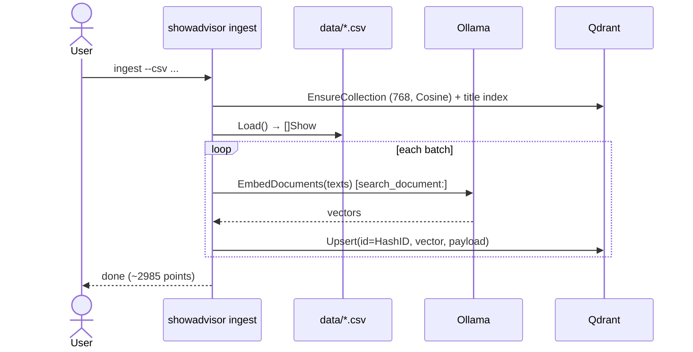
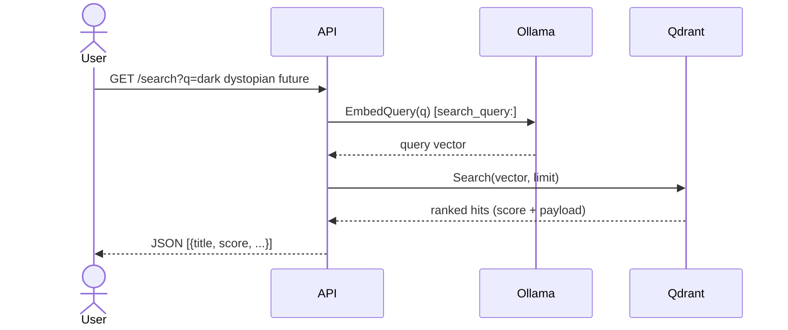
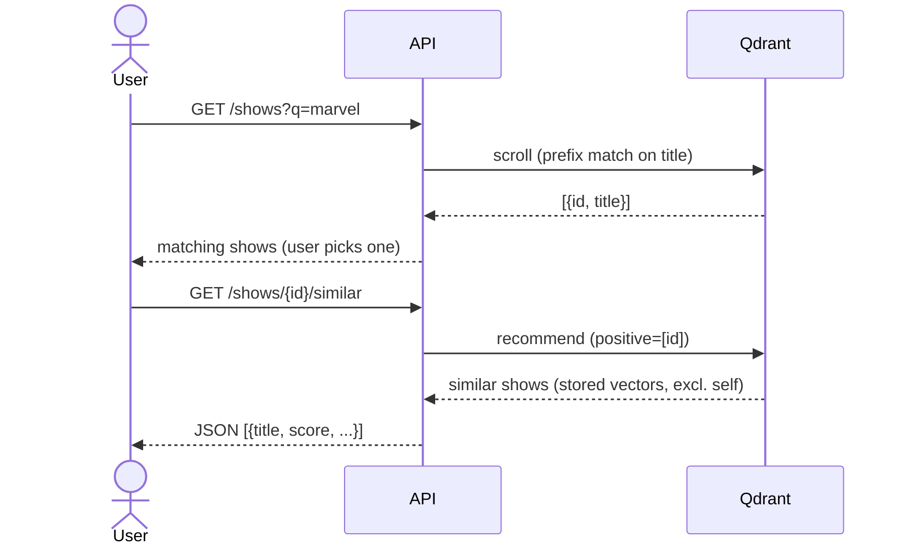

# show_advisor

A TV show advisor: natural-language semantic search over IMDb TV shows, backed by
a vector database. Type a query like *"dark sci-fi with time travel"* and get the
most semantically similar shows — or pick a specific show and get "more like
this".

**Stack:** Go · [Qdrant](https://qdrant.tech) (vector DB) · [Ollama](https://ollama.com)
running `nomic-embed-text` for local embeddings. The app, Qdrant, and Ollama all
run in Docker via Compose.

## Prerequisites

- Docker + Docker Compose
- Go 1.26+ (dev)

## Dataset

This project uses the **IMDb TV Shows** dataset from Kaggle:

> <https://www.kaggle.com/datasets/devanshiipatel/imdb-tv-shows?resource=download>

The dataset is **not committed** to this repo (it's IMDb-derived and
redistribution-restricted). Download it yourself and place the CSV at `data/imdb_tvshows.csv`

## Running

Everything runs in Docker — no local Go needed. After placing the CSV in `data/`:

```sh
make up           # start qdrant + ollama + backend (HTTP API)
make pull-model   # pull nomic-embed-text into Ollama (one-time)
make ingest       # CSV → embeddings → Qdrant (run after pull-model)
```

- API: <http://localhost:8080>
- Qdrant dashboard: <http://localhost:6333/dashboard> (`make dashboard`)

### Local development (optional, needs Go)

```sh
make dev-serve    # go run ./cmd/showadvisor serve
make dev-ingest   # go run ./cmd/showadvisor ingest
```

Other targets: `make down`, `make clean` (wipe volumes), `make logs`.

## Endpoints

| Method | Path                  | Description                                           |
|--------|-----------------------|-------------------------------------------------------|
| `GET`  | `/healthz`            | Liveness check                                        |
| `GET`  | `/search?q=...`       | Semantic search over shows                            |
| `GET`  | `/shows?q=...`        | Find shows by title (pick one to get recommendations) |
| `GET`  | `/shows/{id}/similar` | "More like this" for a chosen show                    |

## How it works

### Ingest



```sh
make ingest
```

### Semantic search — `GET /search`



```sh
curl 'localhost:8080/search?q=dark+dystopian+future&limit=5'
```

### Pick a show → more like this — `GET /shows` then `GET /shows/{id}/similar`

No embedding involved: the lookup is a title-index filter and the recommendation
reuses the show's already-stored vector.



```sh
# 1. find shows by title
curl 'localhost:8080/shows?q=marvel'
#   → [{"id":723797795888263189,"title":"The Marvelous Mrs. Maisel"}, ...]

# 2. recommend similar to a chosen id
curl 'localhost:8080/shows/723797795888263189/similar?limit=5'
```
